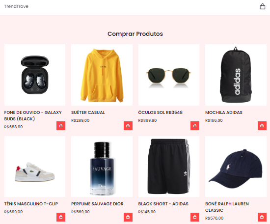
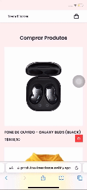

# TrendTrove Store

TrendTrove é uma loja online com um site de controle de compras de carrinho, onde os usuários podem navegar pelos produtos e adicionar itens desejados ao carrinho.

## Demonstração

Confira a versão ao vivo do projeto: [Loja TrendTrove](https://produtos-trendtrove.netlify.app/)

  
  

## Funcionalidades

- Listagem de produtos com imagens e preços
- Adicionar e remover produtos do carrinho de compras
- Checkout simples

## Tecnologias Utilizadas

- **HTML**: Estrutura do site
- **CSS**: Estilização e layout
- **JavaScript**: Funcionalidade interativa
- **Netlify**: Hospedagem do site

Obrigado por visitar o projeto Loja TrendTrove!

